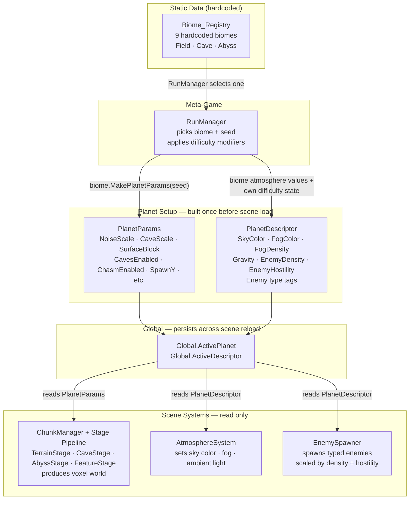

# Planet Generation Plan

> Framework for producing planets with distinct atmospheres, vibes, and gameplay feel. Three templates to start: **Field**, **Cave**, **Abyss**. Adding a new planet type should be a matter of filling in a new descriptor, not restructuring code.

---

## Full System Architecture

### Miro diagram (paste into Miro → Apps → Mermaid)



---

### ASCII reference

```
┌─────────────────────────────────────────────────────────────┐
│  RunManager                                                 │
│  Meta-game: run progression, planet sequencing, rewards.   │
│  Knows nothing about voxels or rendering.                  │
│                                                             │
│  1. Picks a BiomeDescriptor + seed + difficulty modifiers  │
│  2. Calls biome.MakePlanetParams(seed) → PlanetParams      │
│  3. Builds PlanetDescriptor (atmosphere + gameplay mods)   │
│  4. Stores both in Global, reloads scene                   │
└────────────────┬────────────────────────────────────────────┘
                 │ sets Global.ActivePlanet + Global.ActiveDescriptor
                 ▼
┌─────────────────────────────────────────────────────────────┐
│  BiomeDescriptor  (Scripts/The World/BiomeDescriptor.cs)   │
│  One biome = one planet identity.                          │
│                                                             │
│  Owns:                                                      │
│  • Template tag ("Field" / "Cave" / "Abyss")              │
│  • Surface block                                           │
│  • Terrain param ranges → randomised by MakePlanetParams  │
│  • FogColor, SkyColor, AmbientTint (fed to PlanetDesc.)   │
│  • Future: enemy type tags, structure list                 │
└──────────┬──────────────────────────────┬───────────────────┘
           │ MakePlanetParams(seed)        │ atmosphere values
           ▼                              ▼
┌──────────────────────┐   ┌──────────────────────────────────┐
│  PlanetParams        │   │  PlanetDescriptor                │
│  Pure generation     │   │  Planet identity + modifiers     │
│  data. No gameplay   │   │                                  │
│  knowledge.          │   │  • Gravity                       │
│                      │   │  • EnemyDensity, EnemyHostility  │
│  • Template flags    │   │  • SkyColor, FogColor, FogDensity│
│  • FillSolid         │   │  • AmbientLight                  │
│  • NoiseScale        │   │  • RainEnabled                   │
│  • HeightAmplitude   │   │  • PlanetChunksX/Z               │
│  • CaveScale / etc.  │   │                                  │
│  • SurfaceBlock      │   │  Read by: AtmosphereSystem,      │
│  • SpawnY            │   │  EnemySpawner, physics           │
└──────────┬───────────┘   └─────────────┬────────────────────┘
           │                             │
           ▼                             ▼
┌──────────────────────┐   ┌──────────────────────────────────┐
│  Chunk Generation    │   │  AtmosphereSystem  (not built)   │
│  (Chunk_Manager.cs)  │   │                                  │
│                      │   │  Runs on scene load. Reads       │
│  Stage pipeline:     │   │  PlanetDescriptor and applies    │
│  TerrainStage        │   │  settings to WorldEnvironment:   │
│  CaveStage           │   │  sky color, fog, ambient light,  │
│  AbyssStage (shaft)  │   │  sun angle, etc.                 │
│  FeatureStage        │   │                                  │
│    └─ structures     │   │  Peer to ChunkManager — not a    │
│    └─ biome features │   │  generation stage.               │
│    └─ enemy markers  │   │                                  │
└──────────────────────┘   └──────────────────────────────────┘
```

### PlanetDescriptor — when and how it's created

`PlanetDescriptor` is assembled by RunManager **before** the scene loads. Nothing inside the generation pipeline creates or writes to it — it is pre-generation setup.

RunManager builds it from two sources:

| Source | Contributes |
|---|---|
| BiomeDescriptor | SkyColor, FogColor, FogDensity, AmbientTint, enemy type tags |
| RunManager state | Gravity, EnemyDensity, EnemyHostility, difficulty modifiers |

Once built it's stored in Global and never written again. ChunkManager ignores it entirely (reads only `PlanetParams`). AtmosphereSystem and EnemySpawner read from it on scene load.

### Enemy types and biome

Enemy type belongs to `BiomeDescriptor`. Difficulty is separate.

- **BiomeDescriptor** owns a list of enemy type tags — which enemy archetypes can spawn on this planet. A Crystal Caverns planet always spawns crystal-type enemies; a Metallic Mountains planet always spawns heavy/mechanical ones. This is an environmental identity decision, not a difficulty one.
- **PlanetDescriptor** (via RunManager) owns `EnemyDensity` and `EnemyHostility` — how many and how lethal. These are difficulty multipliers applied on top of whatever biome decided.

This means RunManager can reuse the same biome at different points in the run at different difficulty settings, without needing separate "hard desert" / "easy desert" biome definitions.

`EnemySpawner` reads both: biome tags to decide *which* enemy scene to pick, PlanetDescriptor to decide *how often* and *how scaled*.

Enemy type wiring is deferred until enemy designs exist. The tag list field on `BiomeDescriptor` is a placeholder for now.

---

### Separation of concerns

| Layer | Knows about | Does not know about |
|---|---|---|
| RunManager | BiomeDescriptor, progression state | Voxels, rendering |
| BiomeDescriptor | Param ranges, atmosphere values | Generation algorithm |
| PlanetParams | Generation switches and values | Gameplay, rendering |
| PlanetDescriptor | Gameplay modifiers, atmosphere | Voxels |
| ChunkManager / stages | PlanetParams only | Biomes, RunManager |
| AtmosphereSystem | PlanetDescriptor only | Voxels, RunManager |

### What is and isn't built

| System | Status |
|---|---|
| BiomeDescriptor + Biome_Registry (9 biomes) | ✓ built |
| PlanetParams + 3 template presets | ✓ built |
| Chunk generation (terrain + cave + abyss shaft + spawn clear) | ✓ built |
| F3 debug menu (replaces RunManager for now) | ✓ built |
| PlanetDescriptor class | stub only |
| FeatureStage (structures, biome features) | not started |
| AtmosphereSystem | not started |
| RunManager | not started |

---

## Answered Questions

**1. Cave spawn point**
Cave has no surface. Player spawns from a crashlanded ship deep inside the cave network. For the cave template, `SpawnY` defaults to 0 (caves carve at all Y levels so air should exist there). Longer term: a spawn-finder scans from spawn coords outward until it finds a guaranteed open pocket. The ship crash site itself guarantees clearance around it via a FeatureStage carve-out. For now, SpawnY is a configurable param.

**2. Planet size lives in PlanetDescriptor**
`PlanetChunksX` / `PlanetChunksZ` belong to the planet, not to Global or Chunk_Manager as hardcoded values. `PlanetDescriptor` owns them. At planet load, they are applied to `Global.PlanetChunksX/Z`. Stages read `Global.PlanetWidth/Depth` for torus math.

**3. Debug menu now, RunManager later**
Until a planet selection screen exists, a debug `PlanetConfigMenu` (F3 toggle, CanvasLayer autoload) lets you manually set all params and click Generate. Generate calls `Global.SetPlanetConfig(dict)` then `reload_current_scene()`. Global persists across reloads, so Chunk_Manager picks up the new params on `_Ready`. Future: `RunManager` replaces the manual config with pre-generated planet descriptors the player chooses from.

**4. Chasm centered at planet center**
The chasm shaft is anchored at `(PlanetWidth / 2, PlanetDepth / 2)` in canonical world space — the center of the seamless torus. This maximises distance to the seam edges. Drift uses `sin(worldY * DriftScale)` for both X and Z (sin(0)=0 so the surface entrance is exactly at the anchor point), with different frequencies for X and Z so the path doesn't spiral uniformly.

**5. Single source of truth for generation values**
All generation parameters (`NoiseScale`, `HeightAmplitude`, `CaveScale`, `CaveYFrequency`, `CaveThreshold`) are removed from Chunk_Manager `[Export]` fields and live exclusively in `PlanetParams`. `create_chunk_data` reads from `Global.Instance.ActivePlanet`. No more duplicated tuning values.

**6. Pre-generated planet selection (deferred)**
Players will choose from a set of pre-generated planet descriptors that are randomly seeded but constrained to valid ranges. These are generated when the planet select screen opens and shown with previewed attributes. This is a RunManager concern — deferred until that system is built. The debug menu is the interim.

**7. All generation artifacts move to the pipeline**
The inline generation code in `create_chunk_data` is the current single-stage implementation. As the World_Generator stage pipeline is built out (TerrainStage → CaveStage → ChasmStage → FeatureStage), each stage absorbs its piece of `create_chunk_data` until that method is just a thin delegate to `World_Generator.GenerateChunk`. Chunk_Manager keeps no generation logic of its own.

---

## The Two Layers

**1. Generation** — voxel world shape. Handled by `World_Generator` + stages, configured by `PlanetParams`.

**2. Planet Identity** — atmosphere, gravity, modifiers. Held in `PlanetDescriptor`, read by everyone. Generation reads from it but it's not a generation concept.

---

## PlanetDescriptor

Full definition of a planet. Set once at planet load, read by any system that cares.

```csharp
public class PlanetDescriptor
{
    public string   Name;
    public string   Template;          // "Field", "Cave", "Abyss"

    public PlanetParams GenParams;     // generation config

    public int      PlanetChunksX = 64;
    public int      PlanetChunksZ = 64;

    // Gameplay modifiers
    public float    Gravity        = 1.0f;
    public bool     RainEnabled    = false;
    public float    FogDensity     = 0f;
    public float    EnemyDensity   = 1.0f;
    public float    EnemyHostility = 1.0f;

    // Visual / atmosphere
    public Color    SkyColor;
    public Color    FogColor;
    public float    AmbientLight   = 1.0f;
}
```

`Global` holds the active `PlanetDescriptor`. Systems read from it — physics for gravity, renderer for fog, spawner for density. Generation only touches `GenParams`.

---

## PlanetParams

Pure generation data. No gameplay knowledge. Lives in `Scripts/The World/PlanetParams.cs`.

```csharp
public class PlanetParams
{
    public string Template       = "Field";

    // Terrain
    public bool   FillSolid      = false;   // skip height map, fill entire volume solid
    public byte   SurfaceBlock   = 10;      // block ID for solid voxels
    public float  NoiseScale     = 1.5f;
    public float  HeightAmplitude = 10f;
    public int    SpawnY         = 20;

    // Caves
    public bool   CavesEnabled   = false;
    public bool   CaveFullRange  = false;   // carve at all Y, not just underground
    public float  CaveScale      = 3.0f;
    public float  CaveYFrequency = 0.05f;
    public float  CaveThreshold  = 0.25f;

    // Chasm
    public bool   ChasmEnabled   = false;
    public float  ChasmRadius    = 18f;
    public float  ChasmDriftScale = 0.006f;

    // Static presets
    public static PlanetParams MakeField()  { ... }
    public static PlanetParams MakeCave()   { ... }
    public static PlanetParams MakeAbyss()  { ... }
}
```

---

## Generation Architecture

### Stage Pipeline (target state)

```
TerrainStage   — fill solid via height map (skipped if FillSolid)
CaveStage      — 3D two-octave density field carving (skipped if !CavesEnabled)
ChasmStage     — vertical shaft, sinusoidal drift (skipped if !ChasmEnabled)
FeatureStage   — crash site carve-out, accent blocks, enemy spawn markers
```

### Current State

`create_chunk_data` implements terrain + cave + chasm inline using `PlanetParams`. As each stage is properly implemented in `World_Generator`, the matching block of code moves out of `create_chunk_data` and the method shrinks to a delegate.

### Wiring into Chunk_Manager

```csharp
// create_chunk_data — current interim
var p = Global.Instance.ActivePlanet;
// ... inline terrain, cave, chasm using p ...

// create_chunk_data — target
if (WorldGen != null)
    return WorldGen.GenerateChunk(chunkPos, CHUNK_SIZE);
```

---

## Template Hierarchy

```
Height-map path:   Field
                   Abyss  ← Field + ChasmEnabled = true

Full-solid path:   Cave   ← FillSolid + CaveFullRange + CavesEnabled
```

---

## Template Definitions

### Field

| Param | Value |
|---|---|
| FillSolid | false |
| SurfaceBlock | Cloud (8) |
| NoiseScale | 1.5 |
| HeightAmplitude | 10 |
| SpawnY | 20 |
| CavesEnabled | false |
| ChasmEnabled | false |

---

### Abyss

Field params plus:

| Param | Value |
|---|---|
| SurfaceBlock | Steel (6) |
| HeightAmplitude | 8 |
| SpawnY | 20 |
| ChasmEnabled | true |
| ChasmRadius | 18 |
| ChasmDriftScale | 0.006 |

Shaft anchored at `(PlanetWidth/2, PlanetDepth/2)`. Drift uses `sin(Y * DriftScale)` starting at 0 so the surface entrance is exactly at the anchor.

---

### Cave

| Param | Value |
|---|---|
| FillSolid | true |
| SurfaceBlock | Crystal (10) |
| SpawnY | 0 |
| CavesEnabled | true |
| CaveFullRange | true |
| CaveThreshold | 0.3 |
| CaveScale | 2.0 |
| CaveYFrequency | 1.0 |
| ChasmEnabled | false |
| SpawnClearEnabled | true |
| SpawnClearRadiusXZ | 10 |
| SpawnClearRadiusY | 6 |

No surface. Full volume solid, caves carve everywhere via a true 3D two-octave density field (Y encoded as additive torus phase offsets, not worm rotation). SpawnClearEnabled carves a guaranteed open ellipsoid (20×12×20 blocks) centered at WorldSpawn — this runs last in `create_chunk_data` so it cannot be re-filled by cave or chasm carvers. Crash ship scene will be placed here by FeatureStage when it's built.

---

## Future Planet Examples

| Planet | GenParams delta | PlanetDescriptor modifiers |
|---|---|---|
| Low-gravity moon | Field, low HeightAmplitude | Gravity = 0.3 |
| Rain world | Field or Abyss | RainEnabled = true, FogDensity = 0.6 |
| Deep hell | Cave, higher CaveThreshold | AmbientLight = 0.1, EnemyHostility = 2.0 |
| Crystal spires | Field, large HeightAmplitude | SurfaceBlock = LightCrystal |
| Lava zone | Field or Cave | (hazards TBD) |

---

## Implementation Order

1. ~~`PlanetParams` class + presets~~ ✓
2. ~~`Global.SetPlanetConfig` bridge + `ActivePlanet` field~~ ✓
3. ~~Remove generation exports from Chunk_Manager, update `create_chunk_data` to use `PlanetParams`~~ ✓
4. ~~`PlanetConfigMenu` debug UI (F3 toggle, CanvasLayer autoload)~~ ✓
4b. ~~Cave generation — replace worm formula with true 3D two-octave density field~~ ✓
4c. ~~`SpawnClearEnabled` — ellipsoid carve-out at `WorldSpawn`, runs last in `create_chunk_data`~~ ✓
5. Wire `TerrainStage` — port height-map fill from `create_chunk_data`
6. Wire `CaveStage` — port cave carver
7. Build `ChasmStage` — sinusoidal shaft
8. `PlanetDescriptor` class — stub fields, nothing reads them yet
9. Stage by stage: `create_chunk_data` shrinks as stages absorb their piece
10. `RunManager` + planet selection screen replaces debug menu

---

## Biome System

Each template has 3 hardcoded biomes. A biome is a constrained variation on its parent template — same fundamental generation path, but with a specific block palette, terrain parameter range, and optional generation features (structures, enemy types) that give it a distinct feel. One planet = one biome. RunManager picks the biome; generation randomises within its ranges.

### Design rules

- Biome scope: **block palette + terrain param ranges + structures + enemy type tags + atmosphere fog color.** Not gravity, enemy density, or fog toggle — those are `PlanetDescriptor` concerns.
- Fog is always present (to mask chunk load boundary). Its color must match the biome's atmosphere.
- Sub-surface block layering and structure lists are deferred until FeatureStage is built.
- A single surface block per biome for now.

### Structure

```
Template (Field / Cave / Abyss)
  └── BiomeDescriptor  — block palette, param ranges, fog color, future: structures + enemy tags
        └── MakePlanetParams(seed) → PlanetParams  (used by RunManager)
```

`BiomeDescriptor` lives in `Scripts/The World/BiomeDescriptor.cs`.  
`Biome_Registry` (all 9 instances) lives in `Scripts/Datasets/Biome_Registry.cs`.

The F3 debug menu selects a biome and pre-fills param spinboxes with midpoint values. The user can still tweak individual params before generating.

### Biome table

| Template | Biome | Surface Block | Notes |
|---|---|---|---|
| Field | Bouncy Cloud Plains | Cloud (8) | Low amplitude, gentle rolling |
| Field | Grassy Plains | Grass (1) | Medium amplitude |
| Field | Metallic Mountains | Steel (6) | High amplitude, jagged |
| Cave | Tight Stone Tunnels | Stone (3) | High cave scale, high threshold = narrow passages |
| Cave | Crystal Caverns | LightCrystal (11) | Low threshold = large open chambers |
| Cave | The Moss Grotto | Moss (14) | Medium caves, organic feel |
| Abyss | Dark Descent | Stone (3) | Dark, narrow shaft |
| Abyss | The Virus | Virus (16) | Corrupted terrain, irregular shaft |
| Abyss | Lava Walls | Lava (15) | Wide shaft, high amplitude walls |

### New blocks added for biomes

| ID | Name | Hardness |
|---|---|---|
| 13 | Sand | 1 |
| 14 | Moss | 2 |
| 15 | Lava | 3 |
| 16 | Virus | 2 |

Atlas is now full (16/16 slots used). Expanding block count requires resizing the texture atlas.

---

## Open Questions

- **Abyss shaft seamlessness** — drift amplitude (currently 60 blocks) must stay within `PlanetWidth/2 - ChasmRadius` to avoid shaft exiting the edge. Verify at playtest with default planet size.
- **Enemy spawning** — deferred entirely, FeatureStage handles it when the spawn descriptor system is built.
- **Crash ship scene** — open ellipsoid is guaranteed at spawn; the actual ship prop + visual goes here when art is ready.

### Biome open items

- **Atlas full** — 16/16 slots used. Any new block requires expanding the texture atlas (`atlas_width` or `atlas_height` in Block_Registry).
- **Atmosphere fog** — `BiomeDescriptor.FogColor/FogDensity` are stored. Actual Godot `WorldEnvironment` wiring (applying fog color on scene load) is a separate task.
- **Sub-surface layering** — deferred. Will come with FeatureStage (structures). Single surface block is the current model.
- **Enemy type tags** — field exists on `BiomeDescriptor`, unused until enemy variety system is built.
